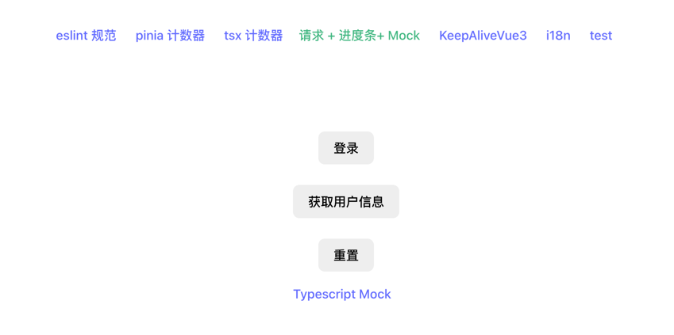
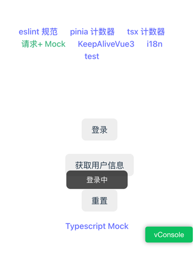

# create vue3/vue2 app template cli
创建vue模板项目，适用于h5和pc，项目支持typescript、ssg、ssr、pwa、pinia、i18n、eslint、test等

### Install
```
npm install vite-app-pro -g
```

### Usage
```
vite-app-pro create helloWorld 
```

```
cd helloWorld && npm run start
```

### Modules

 * vue3/vue2
 * typescript
 * vue-router
 * pinia
 * jsx
 * csr/ssg/ssr mode
 * pwa
 * scss/less/stylus
 * eslint
 * husky
 * i18n
 * unit/e2e test
 * mock data
 * extends keep-alive
 * web terminal
    * ajax progress bar
    * ui component lib:
       * vue2: element-ui
       * vue3: lego
 * H5 terminal
   * vConsole
   * ui component lib: vant

### 模板项目截图

#### web项目




#### h5项目





