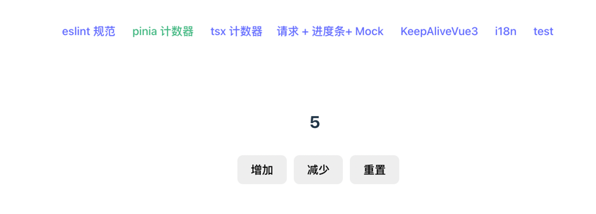
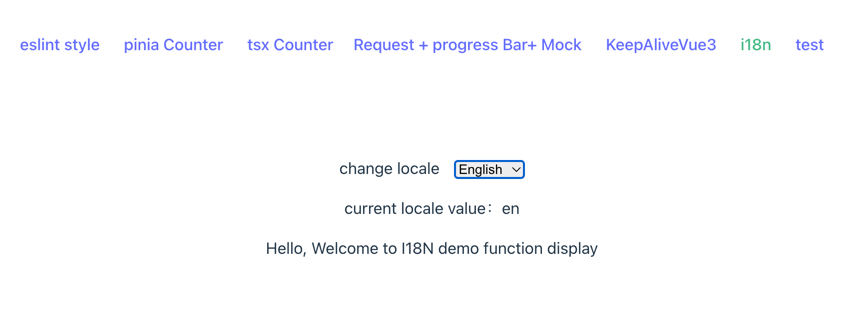
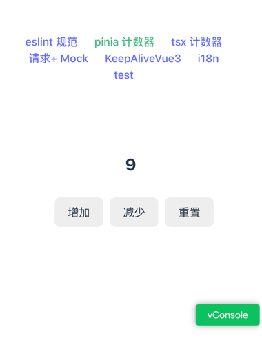
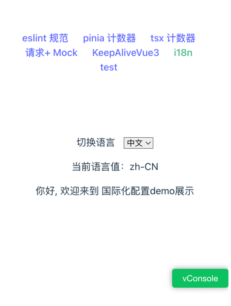
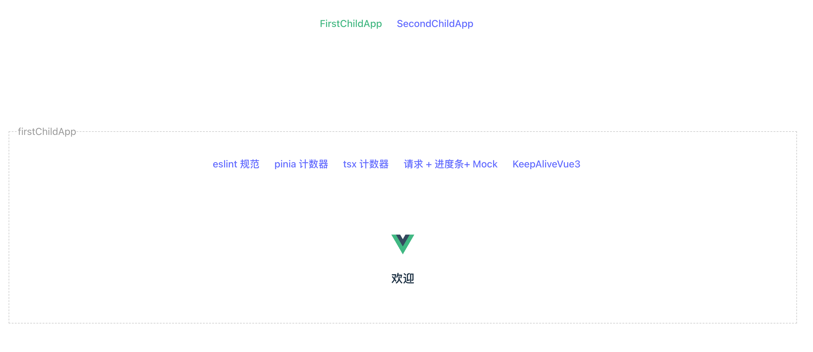
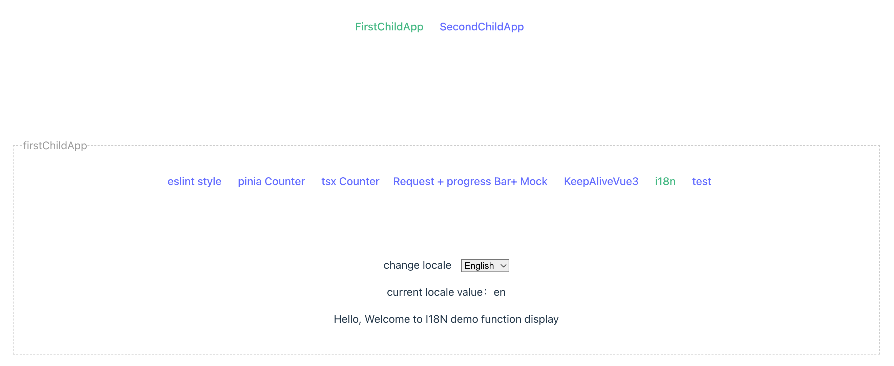

# create vue3/vue2 app template cli
Create vue template project cli，support to create typescript、ssg、ssr、pwa、pinia、i18n、eslint、test and son on.

The cli can create spa projects, support [qiankun](https://qiankun.umijs.org/zh/guide/)

### Install
```
npm install vite-app-pro -g
```

### Usage

create single project
```
vite-app-pro create helloWorld
```


create spa projects
```
vite-app-pro create-spa helloWorld
```

### Modules

 * vue3/vue2
 * typescript
 * vue-router
 * pinia
 * jsx
 * csr/ssg/ssr mode
 * pwa
 * scss/less/stylus
 * eslint
 * husky
 * i18n
 * unit/e2e test
 * mock data
 * extends keep-alive
 * web terminal
    * ajax progress bar
    * ui component lib:
       * vue2: element-ui
       * vue3: element-plus
 * H5 terminal
   * vConsole
   * ui component lib: vant

### 模板项目截图

#### web



#### h5





#### qiankun spa



